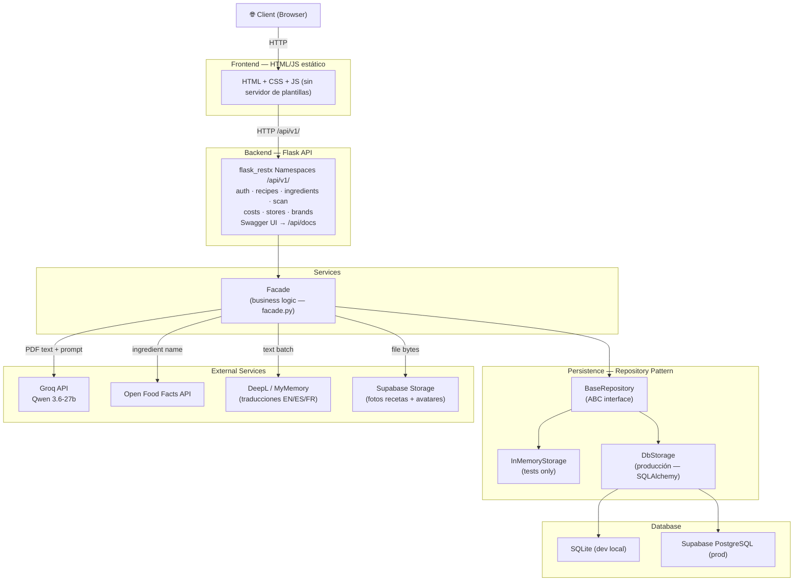
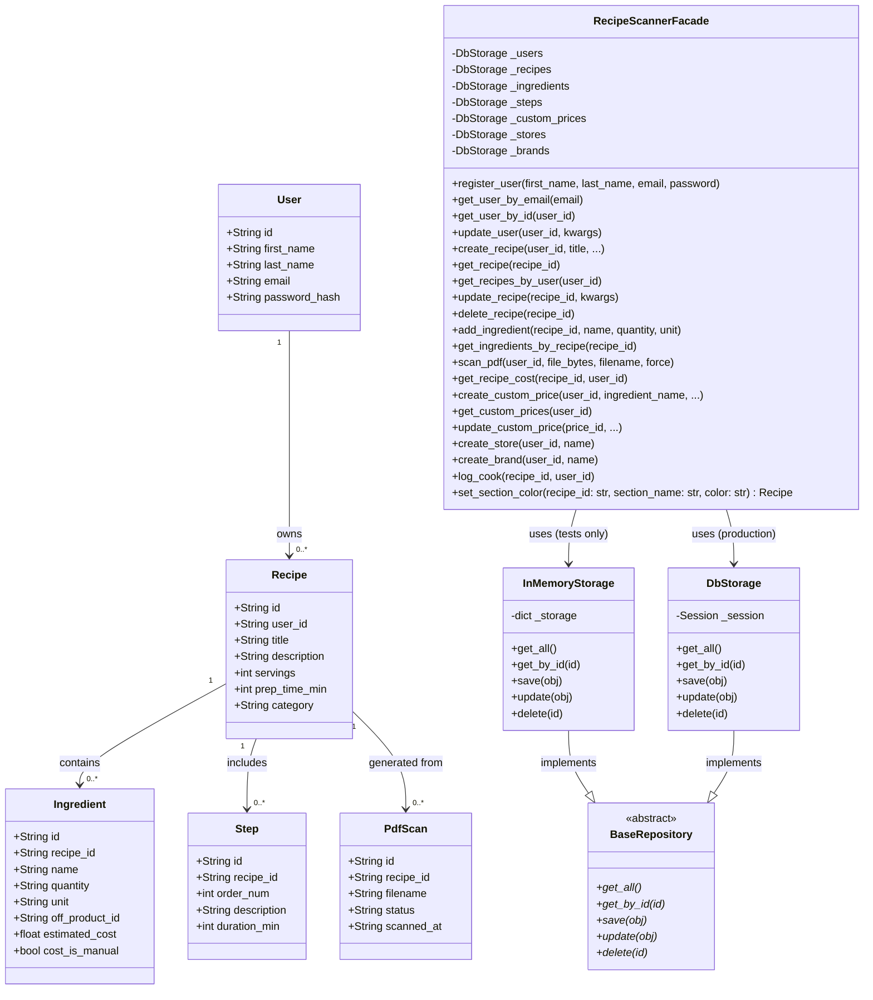
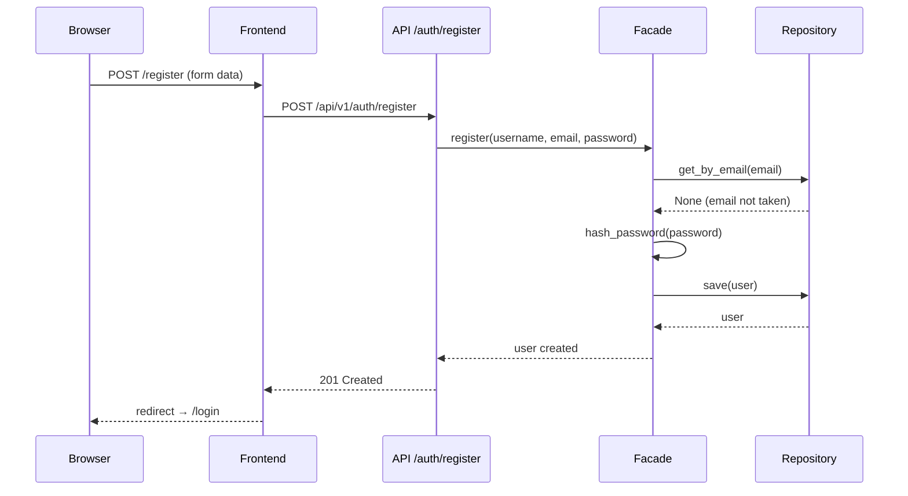
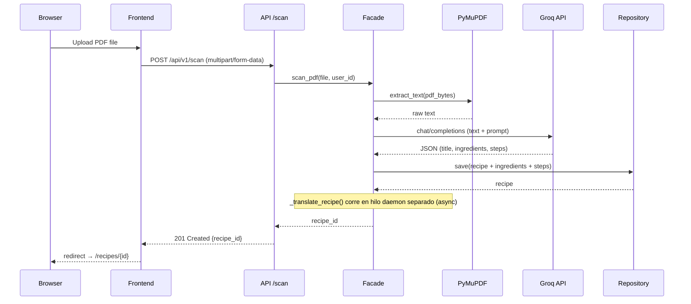
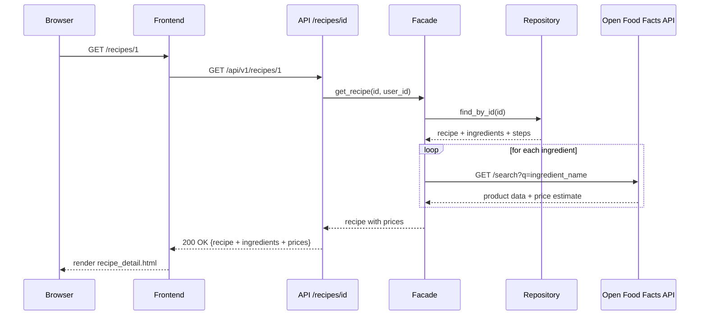

# RecipeScanner — Stage 3: Technical Documentation

Proyecto portfolio — Holberton School RNCP 5 DWWM  
Fecha de entrega: finales de junio 2026

---

## 0. User Stories and Mockups

### User Stories (MoSCoW)

#### Must Have — MVP no funciona sin esto

| ID | Story |
|---|---|
| US-01 | As a user, I want to register an account so that I can save my recipes securely. |
| US-02 | As a user, I want to log in with my email and password so that I can access my personal recipes. |
| US-03 | As a user, I want to upload a PDF of a recipe so that the system extracts ingredients and steps automatically. |
| US-04 | As a user, I want to view a list of all my saved recipes so that I can find them easily. |
| US-05 | As a user, I want to view the full detail of a recipe (ingredients, quantities, steps) so that I can follow it. |
| US-06 | As a user, I want my session to be protected with a token so that other users cannot access my data. |

#### Should Have — Importante pero no bloquea el MVP

| ID | Story |
|---|---|
| US-07 | As a user, I want to see the estimated price of each ingredient so that I can plan my grocery budget. |
| US-08 | As a user, I want to edit a recipe after it has been scanned so that I can correct extraction errors. |
| US-09 | As a user, I want to delete a recipe I no longer need. |

#### Could Have — Deseable si hay tiempo

| ID | Story |
|---|---|
| US-10 | As a user, I want to search my recipes by title so that I can find them quickly. |
| US-11 | As a user, I want to see the total estimated cost of all ingredients in a recipe. |

#### Won't Have — Fuera del alcance del MVP

| ID | Story |
|---|---|
| US-12 | As a user, I want to share recipes with other users. |
| US-13 | As a user, I want to import recipes from a URL. |
| US-14 | As a user, I want to rate and comment on recipes. |

---

### Mockups — Main Screens

**Screen 1 — Login / Register**
```
┌────────────────────────────────────┐
│          RecipeScanner             │
│                                    │
│   Email: [____________________]    │
│   Password: [________________]     │
│                                    │
│   [    Log In    ]  [ Register ]   │
└────────────────────────────────────┘
```

**Screen 2 — Dashboard (My Recipes)**
```
┌────────────────────────────────────┐
│  RecipeScanner    [Upload PDF] [⎋] │
├────────────────────────────────────┤
│  My Recipes                        │
│                                    │
│  ┌──────────┐  ┌──────────┐        │
│  │ Tarta de │  │ Paella   │        │
│  │ manzana  │  │ Valenciana│       │
│  │ 4 serv.  │  │ 6 serv.  │        │
│  └──────────┘  └──────────┘        │
└────────────────────────────────────┘
```

**Screen 3 — Recipe Detail**
```
┌────────────────────────────────────┐
│  ← Back      Tarta de Manzana      │
├────────────────────────────────────┤
│  Servings: 4  |  Prep: 45 min      │
│                                    │
│  INGREDIENTS                       │
│  • 300g flour         ~€0.45       │
│  • 200g sugar         ~€0.30       │
│  • 3 apples           ~€1.20       │
│                                    │
│  STEPS                             │
│  1. Mix flour and butter...        │
│  2. Peel and slice apples...       │
└────────────────────────────────────┘
```

**Screen 4 — PDF Upload / Scan**
```
┌────────────────────────────────────┐
│  Upload Recipe PDF                 │
├────────────────────────────────────┤
│                                    │
│     [ Drag & drop PDF here ]       │
│          or  [Browse file]         │
│                                    │
│  Selected: receta_tarta.pdf ✓      │
│                                    │
│        [ Scan Recipe ]             │
│                                    │
│  ⟳ Extracting ingredients...      │
└────────────────────────────────────┘
```

---

## 1. System Architecture

### High-Level Diagram



### Data Flow

1. El usuario hace una acción en el browser (login, upload PDF, ver receta).
2. El frontend Flask renderiza el template o redirige a la API.
3. La API (Blueprint) recibe la petición, valida el JWT, y delega a la Facade.
4. La Facade orquesta la lógica: llama al Repository para datos locales y a los
   servicios externos (Groq, Open Food Facts) cuando es necesario.
5. El Repository abstrae el storage — la Facade no sabe si habla con RAM o PostgreSQL.
6. La respuesta sube por las capas hasta el browser.

---

## 2. Components, Classes, and Database Design

### Backend Components

| Componente | Archivo | Responsabilidad |
|---|---|---|
| Application Factory | `app/__init__.py` | Crea e inicializa la app Flask con flask_restx, JWTManager y SQLAlchemy |
| Config | `backend/config.py` | Configuración por entornos (dev/test/prod) |
| Auth Namespace | `api/v1/auth.py` | Register, Login, Refresh, GET/PUT/DELETE /me, POST /me/avatar |
| Recipes Namespace | `api/v1/recipes.py` | CRUD de recetas + imágenes + cook log |
| Ingredients Namespace | `api/v1/ingredients.py` | CRUD ingredientes con secciones y preferred store/brand |
| Scan Namespace | `api/v1/scan.py` | Subida PDF → Groq → receta con detección de duplicados |
| Costs Namespace | `api/v1/costs.py` | GET /cost, CRUD /prices, OFF price, manual price override |
| Stores Namespace | `api/v1/stores.py` | CRUD tiendas del usuario |
| Brands Namespace | `api/v1/brands.py` | CRUD marcas del usuario |
| Facade | `services/facade.py` | Punto de entrada único para toda la lógica de negocio |
| Storage | `app/storage.py` | Wrapper Supabase Storage para fotos persistentes |
| Repository (ABC) + InMemoryStorage | `persistence/repository.py` | Interfaz abstracta + implementación en RAM (tests) |
| DbStorage | `persistence/db_storage.py` | Implementación SQLAlchemy para producción |
| Security | `utils/security.py` | Hash y verificación de contraseñas (bcrypt) |

### Domain Models (SQLAlchemy db.Model)

```python
User
├── id: str               # UUID generado automáticamente
├── first_name: str
├── last_name: str
├── email: str            # identificador único de login
├── password_hash: str
└── avatar_url: str

Recipe
├── id: str               # UUID
├── user_id: str          # FK → User
├── title: str
├── title_en / title_es / title_fr: str  # traducciones IA
├── description: str
├── servings: int
├── prep_time_min: int
├── category: str
├── image_url: str
└── section_meta: str     # TEXT, JSON con metadata por sección (color, etc.). Default: '{}'

Ingredient
├── id: str               # UUID
├── recipe_id: str        # FK → Recipe
├── name: str
├── name_en / name_es / name_fr: str  # traducciones IA
├── quantity: str         # str: Groq puede retornar "al gusto"
├── unit: str
├── off_product_id: str
├── estimated_cost: float
├── cost_is_manual: bool
├── manual_price: float   # precio manual del usuario (sobrescribe OFF)
├── price_source: str     # 'custom' | 'off' | 'fallback' | 'manual'
├── section: str          # agrupación (carnes, lácteos, etc.)
├── preferred_store_id: str  # FK → Store
└── preferred_brand_id: str  # FK → Brand

Step
├── id: str               # UUID
├── recipe_id: str        # FK → Recipe
├── order_num: int        # 'order' es keyword reservado en SQL
├── description: str
├── description_en / description_es / description_fr: str
└── duration_min: int

PdfScan
├── id: str               # UUID
├── recipe_id: str        # FK → Recipe
├── filename: str
├── status: str           # 'pending' | 'done' | 'error'
└── scanned_at: str

CustomPrice
├── id: str               # UUID
├── user_id: str          # FK → User
├── ingredient_name: str  # normalizado sin acentos (_norm)
├── store_id: str         # FK → Store (opcional)
├── brand_id: str         # FK → Brand (opcional)
├── bought_qty: float
├── bought_unit: str
├── bought_price: float
└── notes: str

Store / Brand
├── id: str               # UUID
├── user_id: str          # FK → User
└── name: str

CookLog
├── id: str               # UUID
├── recipe_id: str        # FK → Recipe
├── user_id: str          # FK → User
└── cooked_at: str
```

### Class Diagram



---

## 3. High-Level Sequence Diagrams

### Diagrama 1 — Registro de usuario (US-01)



### Diagrama 2 — Subida de PDF y extracción de receta (US-03)



### Diagrama 3 — Ver receta con precios (US-07)



---

## 4. External and Internal APIs

### External APIs

#### Groq API (Qwen 3.6-27b)

- **URL base:** `https://api.groq.com/openai/v1/chat/completions`
- **Auth:** `Authorization: Bearer <GROQ_API_KEY>`
- **Por qué:** inferencia ultrarrápida con hardware LPU especializado. Groq ofrece
  acceso gratuito (free tier). El modelo actual es Qwen 3.6-27b (Alibaba, open-source).
- **Uso en el proyecto:** se le envía el texto extraído del PDF y se le pide que
  devuelva un JSON estructurado con título, ingredientes (nombre, cantidad, unidad)
  y pasos ordenados. Las traducciones EN/ES/FR se hacen por separado (DeepL / MyMemory).

**Ejemplo de request:**
```json
{
  "model": "qwen-qwq-32b",
  "messages": [
    {
      "role": "user",
      "content": "Extract the recipe from this text and return JSON with: title, ingredients (name, quantity, unit), steps (order, description).\n\nText: ..."
    }
  ],
  "temperature": 0.1
}
```

**Ejemplo de response:**
```json
{
  "title": "Tarta de manzana",
  "ingredients": [
    { "name": "harina", "quantity": 300, "unit": "g" },
    { "name": "azúcar", "quantity": 200, "unit": "g" }
  ],
  "steps": [
    { "order": 1, "description": "Mezclar harina y mantequilla..." },
    { "order": 2, "description": "Pelar y cortar las manzanas..." }
  ]
}
```

---

#### Open Food Facts API

- **URL base:** `https://world.openfoodfacts.org/api/v2`
- **Auth:** No requiere autenticación para consultas básicas.
- **Por qué:** única base de datos de alimentos verdaderamente abierta y gratuita,
  con más de 3 millones de productos incluyendo productos europeos y franceses.
  Licencia open data compatible con proyectos educativos.
- **Uso en el proyecto:** búsqueda de productos por nombre de ingrediente para obtener
  el `off_product_id` y datos de precio estimado.

**Endpoint usado:**
```
GET https://world.openfoodfacts.org/cgi/search.pl
  ?search_terms=harina
  &search_simple=1
  &action=process
  &json=1
  &page_size=1
```

**Ejemplo de response (simplificado):**
```json
{
  "products": [
    {
      "id": "3017620422003",
      "product_name": "Harina de trigo",
      "nutriments": { "energy-kcal_100g": 340 }
    }
  ]
}
```

---

### Internal API Endpoints

Base URL: `/api/v1`  
Autenticación: `Authorization: Bearer <JWT_TOKEN>` (excepto register y login)  
Formato: JSON

#### Auth

| Method | Endpoint | Description | Auth |
|---|---|---|---|
| POST | `/auth/register` | Registrar nuevo usuario | No |
| POST | `/auth/login` | Login, retorna JWT + refresh token | No |
| POST | `/auth/refresh` | Renovar access token con refresh token | Yes (refresh) |
| GET | `/auth/me` | Ver perfil del usuario autenticado | Yes |
| PUT | `/auth/me` | Actualizar nombre, email o contraseña | Yes |
| DELETE | `/auth/me` | Eliminar cuenta y todos sus datos | Yes |
| POST | `/auth/me/avatar` | Subir foto de perfil (JPG/PNG/WebP) | Yes |

**POST /auth/register**
```
Input:
{
  "first_name": "Julian",
  "last_name": "Gonzalez",
  "email": "julian@example.com",
  "password": "securepassword123"
}

Output 201:
{
  "message": "User created successfully",
  "user_id": "3f8a1c2d-..."
}

Output 400:
{ "error": "Email already registered" }
```

**POST /auth/login**
```
Input:
{ "email": "julian@example.com", "password": "securepassword123" }

Output 200:
{
  "access_token": "eyJhbGciOiJIUzI1NiIsInR5cCI6IkpXVCJ9...",
  "refresh_token": "eyJhbGciOiJIUzI1NiIsInR5cCI6IkpXVCJ9...",
  "user": {
    "id": "3f8a1c2d-...",
    "first_name": "Julian",
    "last_name": "Gonzalez",
    "email": "julian@example.com",
    "avatar_url": null
  }
}

Output 401:
{ "error": "Invalid credentials" }
```

---

#### Recipes

| Method | Endpoint | Description | Auth |
|---|---|---|---|
| GET | `/recipes` | Listar todas las recetas del usuario | Yes |
| POST | `/recipes` | Crear receta manualmente | Yes |
| GET | `/recipes/<id>` | Ver detalle de una receta | Yes |
| PUT | `/recipes/<id>` | Editar una receta | Yes |
| DELETE | `/recipes/<id>` | Eliminar una receta | Yes |
| PATCH | `/recipes/<recipe_id>/sections/<section_name>/color` | Actualiza el color de una sección de ingredientes | Yes |

**PATCH /recipes/\<recipe_id\>/sections/\<section_name\>/color**
```
Body:
{ "color": "#f39c12" }

Response 200:
{ "section": "masa", "color": "#f39c12" }
```

**GET /recipes/**
```
Output 200:
[
  {
    "id": "3f8a1c2d-...",
    "title": "Tarta de manzana",
    "description": "Receta clásica francesa",
    "servings": 4,
    "prep_time_min": 45,
    "category": "Postres",
    "user_id": "a1b2c3d4-..."
  }
]
```

**GET /recipes/<recipe_id>**
```
Output 200:
{
  "id": "3f8a1c2d-...",
  "title": "Tarta de manzana",
  "description": "Receta clásica francesa",
  "servings": 4,
  "prep_time_min": 45,
  "category": "Postres",
  "user_id": "a1b2c3d4-..."
}

Output 404:
{ "error": "Recipe not found" }
```

---

#### Scan

| Method | Endpoint | Description | Auth |
|---|---|---|---|
| POST | `/scan` | Subir PDF y extraer receta | Yes |

**POST /scan** (también acepta `?force=true` para omitir detección de duplicados)
```
Input: multipart/form-data
  file: <PDF file>

Output 201:
{
  "recipe": {
    "id": "3f8a1c2d-...",
    "title": "Tarta de manzana",
    "category": "Desserts",
    ...
  },
  "ingredients": [...],
  "steps": [...]
}

Output 400:
{ "error": "No file provided" }

Output 409 (duplicado detectado):
{ "error_code": "duplicate", "existing_id": "...", "title": "Tarta de manzana" }

Output 422:
{ "error_code": "no_text" | "groq_failed" }
```

---

#### Ingredients

| Method | Endpoint | Description | Auth |
|---|---|---|---|
| GET | `/recipes/<id>/ingredients` | Listar ingredientes de la receta | Yes |
| POST | `/recipes/<id>/ingredients` | Añadir ingrediente a la receta | Yes |
| PUT | `/recipes/<id>/ingredients/<ing_id>` | Editar ingrediente | Yes |
| DELETE | `/recipes/<id>/ingredients/<ing_id>` | Eliminar ingrediente | Yes |

#### Costs & Custom Prices

| Method | Endpoint | Description | Auth |
|---|---|---|---|
| GET | `/recipes/<id>/cost` | Calcular costo total de la receta | Yes |
| GET | `/prices` | Listar precios personalizados del usuario | Yes |
| POST | `/prices` | Crear precio personalizado | Yes |
| PUT | `/prices/<price_id>` | Editar precio personalizado | Yes |
| DELETE | `/prices/<price_id>` | Eliminar precio personalizado | Yes |
| PUT | `/recipes/<id>/ingredients/<ing_id>/price` | Sobrescribir precio manualmente | Yes |
| DELETE | `/recipes/<id>/ingredients/<ing_id>/price` | Eliminar override de precio manual | Yes |

#### Stores & Brands

| Method | Endpoint | Description | Auth |
|---|---|---|---|
| GET | `/stores` | Listar tiendas del usuario | Yes |
| POST | `/stores` | Crear tienda | Yes |
| DELETE | `/stores/<store_id>` | Eliminar tienda | Yes |
| GET | `/brands` | Listar marcas del usuario | Yes |
| POST | `/brands` | Crear marca | Yes |
| DELETE | `/brands/<brand_id>` | Eliminar marca | Yes |

---

## 5. SCM and QA Strategies

### Source Control Management (SCM)

**Herramienta:** Git + GitHub

**Branching strategy:**
```
main
  └── develop
        └── feature/sqlalchemy   ← solo para el swap a SQLAlchemy (Session 8)
```

| Branch | Propósito |
|---|---|
| `main` | Código listo para producción. Solo recibe merges de `develop` al final de cada sprint. |
| `develop` | Rama principal de desarrollo. Todo el trabajo del MVP va aquí directamente. |
| `feature/sqlalchemy` | Única feature branch — aísla el swap de InMemoryStorage → SQLAlchemy (Session 8). Se crea desde `develop` y se mergea a `develop` una vez validado. |

**Reglas:**
- Nunca hacer commits directamente en `main`.
- El trabajo diario va directamente a `develop` (proyecto solo, sin equipo que revisar en paralelo).
- `feature/sqlalchemy` se crea únicamente en Session 8 para aislar el cambio de base de datos.
- Commits con mensajes descriptivos: `feat: add User dataclass`, `fix: jwt expiration bug`.
- Merge a `main` solo al completar cada sprint con todos los tests pasando.

**Convención de commits (Conventional Commits):**
```
feat:     nueva funcionalidad
fix:      corrección de bug
docs:     cambios en documentación
refactor: refactorización sin cambio de comportamiento
test:     añadir o modificar tests
chore:    tareas de mantenimiento (deps, config)
```

**.gitignore — archivos que nunca van al repositorio:**
```
venv/
.env
__pycache__/
*.db
instance/
*.pyc
.DS_Store
backend/app/static/uploads/avatars/*
backend/app/static/uploads/recipes/*
!backend/app/static/uploads/avatars/.gitkeep
!backend/app/static/uploads/recipes/.gitkeep
```

Los directorios de uploads existen en el repo gracias a archivos `.gitkeep` pero los archivos subidos por los usuarios (JPEGs de avatars e imágenes de recetas) están excluidos. Esto previene que imágenes privadas de usuarios aparezcan en GitHub.

---

### Quality Assurance (QA)

**Estrategia de testing por capas:**

| Capa | Tipo de test | Herramienta | Qué verifica |
|---|---|---|---|
| Models | Unit test | `pytest` | Creación correcta de objetos, valores por defecto |
| Repository | Unit test | `pytest` | CRUD contra InMemoryStorage |
| Facade | Integration test | `pytest` | Lógica de negocio con repo en memoria |
| API endpoints | Integration test | `pytest` + `Flask test client` | Respuestas HTTP, autenticación JWT |
| PDF extraction | Manual + mock | `pytest` + PDF de prueba | Extracción correcta de texto |
| Open Food Facts | Mock | `pytest` + `unittest.mock` | Respuesta simulada de la API externa |

**Herramientas:**
- `pytest` — framework de tests para Python
- `Flask test client` — cliente HTTP integrado en Flask para testear endpoints sin levantar servidor
- `unittest.mock` — para simular respuestas de APIs externas (Groq, Open Food Facts)

**Cobertura mínima esperada:** 70% del código de `models/`, `persistence/` y `services/`.

**Pipeline de QA:**

```
1. Desarrollador escribe código en develop (o feature/sqlalchemy para Session 8)
2. Corre tests localmente: pytest backend/
3. Verifica con Postman los endpoints afectados
4. Hace commit con mensaje Conventional Commits
5. Merge a main solo cuando el sprint está completo y todos los tests pasan
```

**Tests manuales para el flujo crítico:**
- Subir un PDF de receta real → verificar extracción correcta
- Registrar usuario → login → ver recetas → precio de ingredientes
- Intentar acceder a receta de otro usuario → verificar que retorna 403

---

## 6. Technical Justifications

**Resumen:**

| Decisión | Alternativas consideradas | Por qué se eligió |
|---|---|---|
| Flask | Django, FastAPI | Control total, Jinja2 integrado, curva de aprendizaje baja |
| SQLAlchemy | SQL directo, Django ORM | Portabilidad SQLite→PostgreSQL, prevención SQL injection |
| Repository Pattern | Acceso directo a BD | Testabilidad, intercambiabilidad, bajo acoplamiento |
| In-memory first | SQLAlchemy desde el inicio | Validar lógica sin complejidad de BD, desarrollo más rápido |
| JWT | Sessions, OAuth | Stateless, escalable, estándar REST |
| bcrypt | MD5, SHA-256 | Lento por diseño, incluye salt, resistente a fuerza bruta |
| Groq + Qwen 3.6-27b | OpenAI GPT-4 | Más rápido (LPU), open-source, tier gratuito, sin costo |
| Open Food Facts | APIs de supermercados | Abierta, gratuita, sin acuerdo comercial, 3M+ productos |
| Frontend HTML/JS estático | React, Vue, Jinja2 | Desacoplado del backend, mismo consumidor que app móvil futura |
