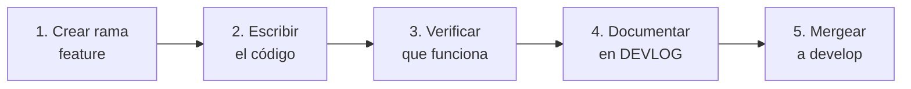
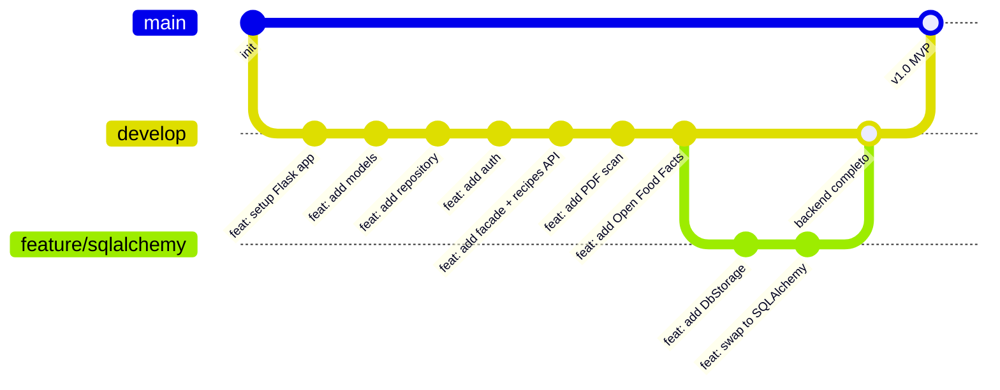

# RecipeScanner — Flujo de trabajo

---

## Ciclo de trabajo por sesión

Cada sesión sigue siempre el mismo ciclo:



### Paso a paso

**1. Crear la rama**
```bash
git checkout develop
git checkout -b feature/nombre-del-feature
```

**2. Escribir el código**
- Se propone el código, se revisa, y se aprueba antes de escribirlo al archivo.
- Comentarios en inglés, documentación en español.

**3. Verificar que funciona**
```bash
# Activar el entorno virtual (siempre antes de correr cualquier cosa)
source backend/venv/bin/activate

# Correr el archivo directamente
python backend/run.py

# O correr los tests
pytest backend/
```

**4. Documentar en DEVLOG**
- Agregar la explicación línea a línea del archivo escrito.
- Registrar cualquier decisión técnica nueva que surgió.
- Marcar la tarea como completada en la sección Progreso.

**5. Mergear a develop**
```bash
git add <specific files>
git commit -m "feat: description of the change"
git checkout develop
git merge feature/feature-name
```

---

## Convención de commits

```
feat:     nueva funcionalidad
fix:      corrección de bug
docs:     cambios en documentación
refactor: refactorización sin cambio de comportamiento
test:     añadir o modificar tests
chore:    tareas de mantenimiento (deps, config)
```

**Ejemplos:**
```bash
git commit -m "feat: add User dataclass"
git commit -m "feat: implement InMemoryStorage CRUD"
git commit -m "feat: add BaseRepository abstract interface"
git commit -m "feat: add register and login endpoints"
git commit -m "feat: integrate Groq API for PDF extraction"
git commit -m "feat: add Open Food Facts price lookup"
git commit -m "feat: swap InMemoryStorage to SQLAlchemy DbStorage"
git commit -m "fix: jwt token expiration not set"
git commit -m "fix: bcrypt hash comparison returning false"
git commit -m "refactor: move price logic from API to Facade"
git commit -m "test: add unit tests for Facade.register_user"
git commit -m "chore: add python-dotenv to requirements.txt"
```

> **Nota:** todos los mensajes de commit van en inglés — el jury del RNCP
> revisará el historial de Git.

---

## Estrategia de ramas

Proyecto individual → dos ramas. Las ramas múltiples sirven para que varios desarrolladores trabajen en paralelo sin pisarse. Solo, ese problema no existe.



| Rama | Propósito |
|---|---|
| `main` | Solo para versiones estables y entregables. Recibe merges de `develop`. |
| `develop` | Donde se trabaja el día a día. Un commit por archivo o funcionalidad completada. |
| `feature/sqlalchemy` | Única excepción — rama temporal para el swap a SQLAlchemy (Sesión 8) porque puede romper lo que ya funciona. |

**Regla:** nunca hacer commits directamente en `main`.

---

## Plan de sesiones

| Sesión | Rama | Archivos | Objetivo |
|---|---|---|---|
| 1 | `develop` | `app/__init__.py`, `run.py`, `.env`, `.gitignore`, `requirements.txt` | Flask corriendo en localhost:5000 |
| 2 | `develop` | `models/user.py`, `recipe.py`, `ingredient.py`, `step.py`, `pdf_scan.py` | 5 dataclasses definidas |
| 3 | `develop` | `persistence/repository.py` (BaseRepository + InMemoryStorage) | CRUD en memoria funcionando |
| 4 | `develop` | `utils/security.py`, `api/v1/auth.py`, `app/__init__.py` (JWTManager + flask_restx) | Register + Login con JWT |
| 5 | `develop` | `services/facade.py`, `api/v1/recipes.py`, `api/v1/ingredients.py` | CRUD recetas validado |
| 6 | `develop` | `api/v1/scan.py` + Groq en facade | PDF → receta extraída |
| 7 | `develop` | Open Food Facts en facade | Precios de ingredientes |
| 8 | `feature/sqlalchemy` | `persistence/db_storage.py`, `config.py` actualizado | Swap a SQLAlchemy — backend completo |
| 9 | `develop` | `templates/`, `static/` | Jinja2 — UI server-side integrada en Flask |

> **Nota — Sesión 9 (Frontend):**
> Decisión confirmada: **Jinja2 + HTML/CSS/JS** (React descartado).
> Un solo servidor, sin build process separado, sin CORS, sin deploy adicional.
> Proyecto individual con deadline fin de junio 2025 — Jinja2 permite terminar en tiempo sin comprometer la funcionalidad core.

---

## Reglas del proyecto

- **Código:** comentarios en inglés.
- **Documentación:** DEVLOG en español.
- **Archivos sensibles** (`.env`, `*.db`, `venv/`) nunca van a GitHub.
- **Cada archivo nuevo** se documenta en DEVLOG con su explicación línea a línea.
- **Cada decisión técnica** se justifica antes de implementarla.
- **Un solo archivo por vez** — terminar y documentar antes de pasar al siguiente.

---

## Checklist antes de cada merge

```
[ ] El código funciona (no hay errores al correr)
[ ] Los tests pasan (pytest)
[ ] El archivo está documentado en DEVLOG
[ ] Los archivos sensibles NO están en el commit
[ ] El mensaje de commit sigue la convención
```
