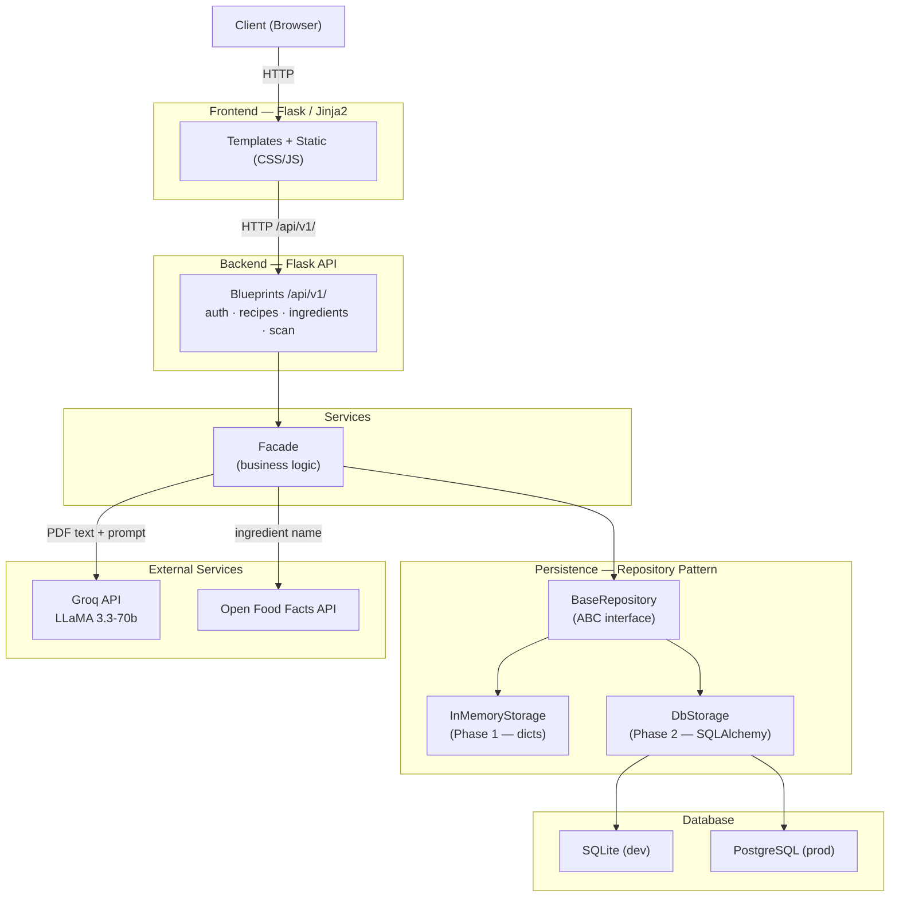
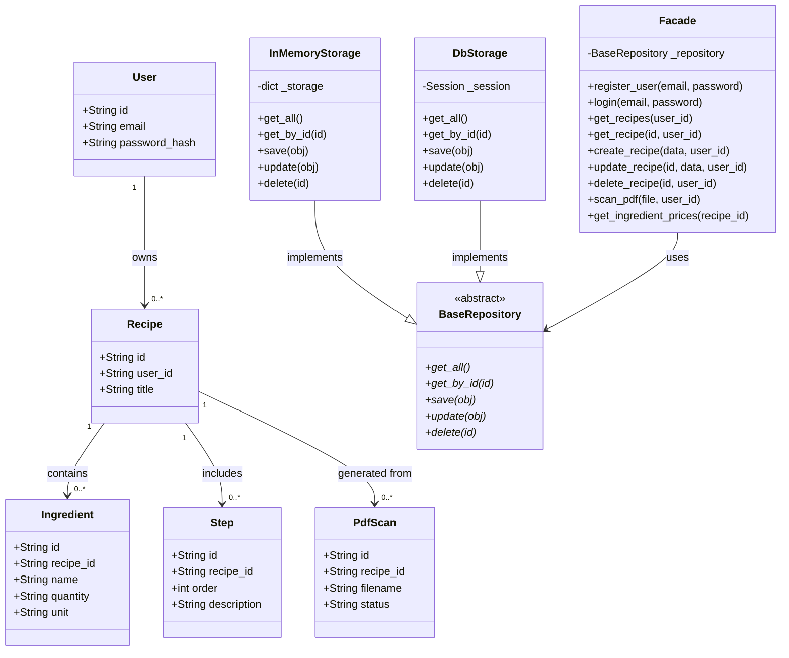

# RecipeScanner

A full-stack web application that extracts recipes from PDF files using AI, saves them to a database, and estimates ingredient prices via Open Food Facts.

Built as a portfolio project for Holberton School — RNCP 5 DWWM certification.

---

## Features

- Upload a PDF recipe and extract ingredients and steps automatically using Groq API (LLaMA 3.3-70b)
- User authentication with JWT tokens and bcrypt password hashing
- Save, view, edit, and delete recipes
- Estimate ingredient prices via Open Food Facts API
- Secure per-user data isolation — users can only access their own recipes

---

## Tech Stack

| Layer | Technology |
|---|---|
| Backend | Python 3, Flask 3.x |
| Authentication | PyJWT + bcrypt |
| PDF Extraction | PyMuPDF |
| AI / NLP | Groq API — LLaMA 3.3-70b |
| Ingredient Prices | Open Food Facts API |
| Database | SQLite (dev) → PostgreSQL (prod) |
| ORM | SQLAlchemy 2.x |
| Frontend | Jinja2 + HTML/CSS/JS |

---

## Application Architecture



### Data Flow

1. User performs an action in the browser (login, upload PDF, view recipe).
2. Flask renders the template or routes the request to the API.
3. The API Blueprint receives the request, validates the JWT, and delegates to the Facade.
4. The Facade orchestrates the logic: calls the Repository for local data and external services (Groq, Open Food Facts) when needed.
5. The Repository abstracts the storage layer — the Facade does not know whether it is talking to RAM or PostgreSQL.
6. The response travels back up through the layers to the browser.

---

## Database Diagram



---

## Project Structure

```
recipe-scanner/
├── backend/
│   ├── app/
│   │   ├── __init__.py          # Application factory (create_app)
│   │   ├── api/v1/
│   │   │   ├── auth.py          # Register + Login endpoints
│   │   │   ├── recipes.py       # Recipe CRUD endpoints
│   │   │   ├── ingredients.py   # Ingredient price endpoints
│   │   │   └── scan.py          # PDF upload + extraction endpoint
│   │   ├── models/
│   │   │   ├── user.py
│   │   │   ├── recipe.py
│   │   │   ├── ingredient.py
│   │   │   ├── step.py
│   │   │   └── pdf_scan.py
│   │   ├── persistence/
│   │   │   ├── repository.py    # BaseRepository ABC
│   │   │   └── memory_storage.py
│   │   ├── services/
│   │   │   └── facade.py        # Business logic
│   │   └── utils/
│   │       ├── jwt_helper.py
│   │       └── security.py
│   ├── config.py                # Environment-based configuration
│   ├── run.py                   # Entry point
│   └── requirements.txt
└── frontend/                    # Jinja2 templates (Phase 9)
```

---

## API Endpoints

Base URL: `/api/v1`
Authentication: `Authorization: Bearer <JWT_TOKEN>` (except register and login)

| Method | Endpoint | Description | Auth |
|---|---|---|---|
| POST | `/auth/register` | Register a new user | No |
| POST | `/auth/login` | Login, returns JWT token | No |
| GET | `/recipes` | List all recipes for the logged-in user | Yes |
| POST | `/recipes` | Create a recipe manually | Yes |
| GET | `/recipes/<id>` | Get full recipe detail | Yes |
| PUT | `/recipes/<id>` | Update a recipe | Yes |
| DELETE | `/recipes/<id>` | Delete a recipe | Yes |
| POST | `/scan` | Upload PDF and extract recipe via Groq | Yes |
| GET | `/recipes/<id>/ingredients` | Get ingredients with price estimates | Yes |

---

## Local Setup

**Requirements:** Python 3.8+, pip

```bash
# Clone the repository
git clone https://github.com/juliangf94/recipe-scanner.git
cd recipe-scanner/backend

# Create and activate virtual environment
python3 -m venv venv
source venv/bin/activate      # Linux/Mac
venv\Scripts\activate         # Windows

# Install dependencies
pip install -r requirements.txt

# Create .env file and add your keys
cp .env.example .env

# Run the development server
python run.py
```

The server will start at `http://localhost:5000`.

---

## Environment Variables

| Variable | Description |
|---|---|
| `SECRET_KEY` | Flask session signing key |
| `JWT_SECRET_KEY` | JWT token signing key |
| `GROQ_API_KEY` | API key from console.groq.com |
| `FLASK_ENV` | `development` / `production` |
| `DATABASE_URL` | PostgreSQL URL (production only) |

---

## Branching Strategy

| Branch | Purpose |
|---|---|
| `main` | Production-ready code only. Receives merges from `develop`. |
| `develop` | Day-to-day work. One commit per completed feature or file. |
| `feature/sqlalchemy` | Temporary branch — Session 8 only. Isolated because swapping the storage layer can break existing functionality. |

---

## Author

**Julian Garcia**
Holberton School — RNCP 5 DWWM
GitHub: [juliangf94](https://github.com/juliangf94)
