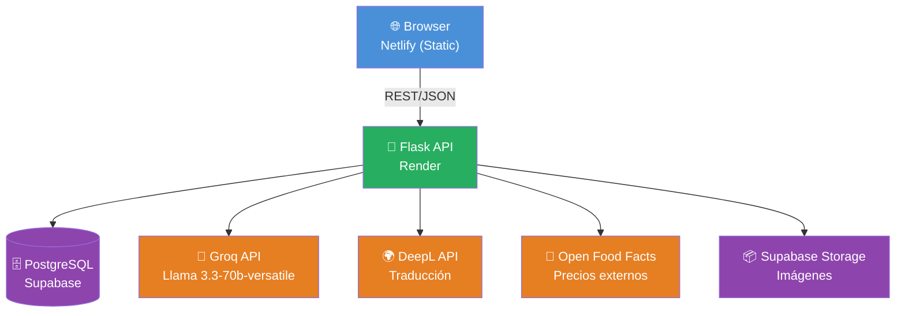
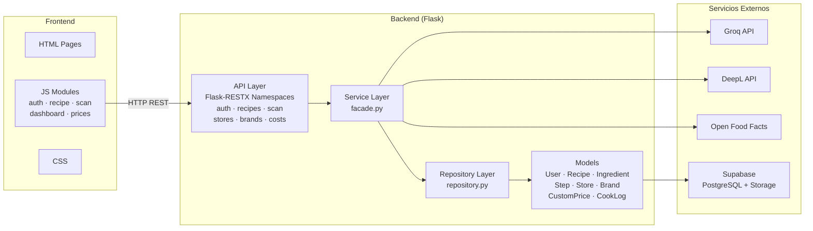
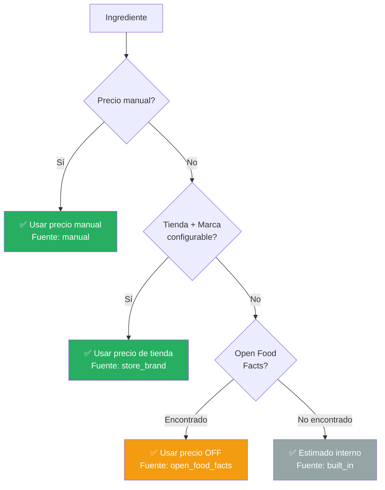

# RecipeScanner — Presentación Final
**Julian Gonzalez · Holberton School · 2026**

---

## 1. Introducción Personal

- Nombre: **Julian Gonzalez**
- Proyecto: **RecipeScanner**
- Duración: 2 meses · 10 sprints

> *"Me gusta preparar tortas para los cumpleaños de mis amigos y familia.
> Cada vez que alguien me pedía el precio, tenía que investigar ingrediente
> por ingrediente. Necesitaba una herramienta que lo hiciera automáticamente."*

---

## 2. El Problema

- Calcular el costo de una receta es **tedioso** — investigación manual de precios
- Las recetas nuevas, especialmente en otro idioma, son difíciles de procesar rápido
- No existe una herramienta que combine en un solo lugar:
  - Extracción automática desde PDF
  - Cálculo de costos por ingrediente
  - Traducción a múltiples idiomas

---

## 3. Demo en Vivo

Flujo a seguir durante la demo:

```
1. Abrir recipescanner-landing.netlify.app  →  mostrar landing page
2. Click "Open App"  →  login
3. Scan: subir un PDF de receta
4. Mostrar resultado: título, ingredientes, pasos, tiempo de prep
5. Ver costos calculados automáticamente (fuente de precio visible)
6. Cambiar idioma: EN → ES → FR
7. Editar un ingrediente y cambiar tienda/marca
8. Activar modo oscuro con el toggle ☀/🌙 del sidebar — mostrar que persiste al recargar
9. Cambiar el color de una sección de ingredientes (ej: "masa" → color naranja)
```

**URL app:** https://recipes-scanner.netlify.app
**URL landing:** https://recipescanner-landing.netlify.app

---

## 4. Stack Tecnológico

| Capa | Tecnología |
|---|---|
| Frontend | HTML, CSS, Vanilla JS |
| Backend | Python 3, Flask, Flask-RESTX |
| Base de datos | SQLAlchemy + PostgreSQL (Supabase) |
| IA — extracción | Groq API · Llama 3.3-70b-versatile (vision fallback: llama-4-scout) |
| Traducción | DeepL API |
| Precios externos | Open Food Facts API |
| Storage de imágenes | Supabase Storage |
| Deploy frontend | Netlify |
| Deploy backend | Render |
| Tests | 107 pytest + 204 Newman = **311 total** |

---

## 5. Arquitectura



**Flujo de una petición típica (scan de receta):**

```
Usuario sube PDF
    → Frontend envía archivo al backend (multipart/form-data)
    → Backend extrae texto del PDF
    → Llama a Groq API con el texto (Llama 3.3-70b-versatile)
    → Groq devuelve JSON estructurado (título, ingredientes, pasos)
    → Backend guarda en PostgreSQL
    → Backend llama a DeepL para traducir a EN/ES/FR
    → Frontend recibe la receta completa y renderiza
```

---

## 6. Diagrama de Paquetes (Backend)



---

## 7. Fragmento de Código — Sistema de Precios

**Este es el corazón del proyecto.** La facade resuelve el precio de cada ingrediente
consultando 4 fuentes en orden de prioridad:

```python
def resolve_ingredient_price(ingredient, stores, brands, custom_prices):
    """
    Resuelve el precio por kg de un ingrediente en orden de prioridad.
    Siempre devuelve un valor — el nivel 4 garantiza un estimado.
    """

    # Nivel 1: Precio manual del usuario (máxima prioridad)
    if ingredient.manual_price:
        return ingredient.manual_price, "manual"

    # Nivel 2: Precio por tienda y marca preferida
    price = lookup_store_brand_price(ingredient, stores, brands, custom_prices)
    if price:
        return price, "store_brand"

    # Nivel 3: Open Food Facts (base de datos pública)
    price = lookup_open_food_facts(ingredient.name)
    if price:
        return price, "open_food_facts"

    # Nivel 4: Estimado interno por kg (fallback garantizado)
    fallback = PER_KG_FALLBACKS.get(normalize(ingredient.name), DEFAULT_PRICE)
    return fallback, "built_in"
```

> *"Esto garantiza que siempre hay un estimado de costo, sin importar si el
> usuario cargó precios o no. La app nunca muestra un '—' sin explicación."*

---

## 8. Sistema de Resolución de Precios (Flujo)



---

## 9. Retos Técnicos

### JWT Refresh Token Loop
El backend usa access tokens (15 min) + refresh tokens (30 días).
El reto fue evitar que una petición fallida por token expirado entrara en
un bucle infinito de refresh. Solución: flag `_isRefreshing` en el cliente.

```javascript
// api.js — evita bucle de refresh
let _isRefreshing = false;

async function apiFetch(path, options = {}) {
  let res = await fetchWithAuth(path, options);
  if (res.status === 401 && !_isRefreshing) {
    _isRefreshing = true;
    const refreshed = await refreshToken();
    _isRefreshing = false;
    if (refreshed) return fetchWithAuth(path, options);
    logout();
  }
  return res;
}
```

### Respuestas no deterministas de Llama 3.3-70b-versatile
El mismo PDF podía devolver estructuras JSON diferentes entre llamadas.
Solución: prompt estructurado con JSON schema explícito + validación y
retry automático si la respuesta no parsea correctamente.

### Tests de integración con Newman
Mantener 109 requests de Postman sincronizados con la API en evolución
durante 9 sprints fue un desafío de disciplina — cada cambio de contrato
rompía tests existentes.

---

## 10. Aprendizajes

- Cómo estructurar una API REST con Flask-RESTX y documentación Swagger automática
- Integrar LLMs en producción real (rate limits, prompts, parsing de respuestas)
- Diseñar autenticación segura con JWT + refresh tokens sin bucles
- **Tomar decisiones de MVP**: abandonar features para cumplir con los sprints
- Aprendí a **enviar algo real y funcional**, no solo un ejercicio

---

## 11. Futuras Mejoras

- Compresión automática de imágenes al subir (actualmente hasta 880 KB por foto)
- Modo PWA / offline para ver recetas sin conexión
- Comparador de precios entre tiendas para el mismo ingrediente
- Exportar receta con costos calculados a PDF
- Notificaciones de cambio de precio en ingredientes guardados

---

## 12. Q&A — Preguntas Frecuentes

| Pregunta probable | Respuesta preparada |
|---|---|
| ¿Por qué Vanilla JS y no React? | MVP rápido, sin build tools, deploy directo en Netlify sin pipeline |
| ¿Por qué Groq y no OpenAI? | Groq es más rápido (inferencia en hardware especializado) y gratuito para el volumen de uso del MVP |
| ¿Qué pasa si Llama devuelve JSON mal formado? | Validación del schema + retry automático con prompt más estricto |
| ¿Por qué 4 fuentes de precio y no solo una? | Ninguna fuente cubre el 100% de los ingredientes. La cascada garantiza siempre tener un estimado |
| ¿Cómo manejás la seguridad del token? | Access token de 15 min en memoria, refresh token de 30 días, flag anti-loop en el cliente |
| ¿Cuántos tests tenés? | 311: 107 pytest (unitarios e integración) + 204 Newman (contrato de API) |
| ¿Por qué el modo oscuro usa `localStorage` y no solo `prefers-color-scheme` de CSS? | Con `prefers-color-scheme` el usuario no puede elegir un tema distinto al de su sistema operativo. Con `localStorage` y un toggle, el usuario puede decidir independientemente. Además, `theme.js` se carga de forma síncrona en `<head>` para evitar el flash de tema incorrecto (FOUC) antes de que el navegador pinte la página. |
| ¿Por qué `section_meta` es una columna TEXT con JSON y no una tabla separada? | Las secciones son dinámicas y en pequeña cantidad por receta (típicamente 2–5). Una tabla separada requeriría un JOIN extra en cada carga de receta sin beneficio real. El JSON embebido en TEXT es suficiente para este volumen de datos. |
| ¿Por qué la traducción corre en un hilo separado? | Render tiene un límite de 30 segundos por request HTTP. La traducción con DeepL puede tardar 5–15 segundos para recetas largas. Sin el hilo, el usuario veía un error de conexión aunque la receta se había creado correctamente. Con el hilo daemon, la respuesta HTTP se retorna inmediatamente y la traducción completa los campos en segundo plano. |

---

## Checklist Pre-Presentación

- [ ] Demo video subido a YouTube y URL actualizada en la landing page
- [ ] Probar el flujo completo de la demo en el browser de la presentación
- [ ] Tener un PDF de receta listo para escanear en vivo
- [ ] Abrir la landing page y la app en tabs separados
- [ ] Verificar que el backend no está en cold start (abrir la app 2 min antes)
- [ ] Tener el fragmento de código listo para mostrar (facade.py)

---

*Portfolio Project · Holberton School · 2026 · github.com/juliangf94/recipe-scanner*
